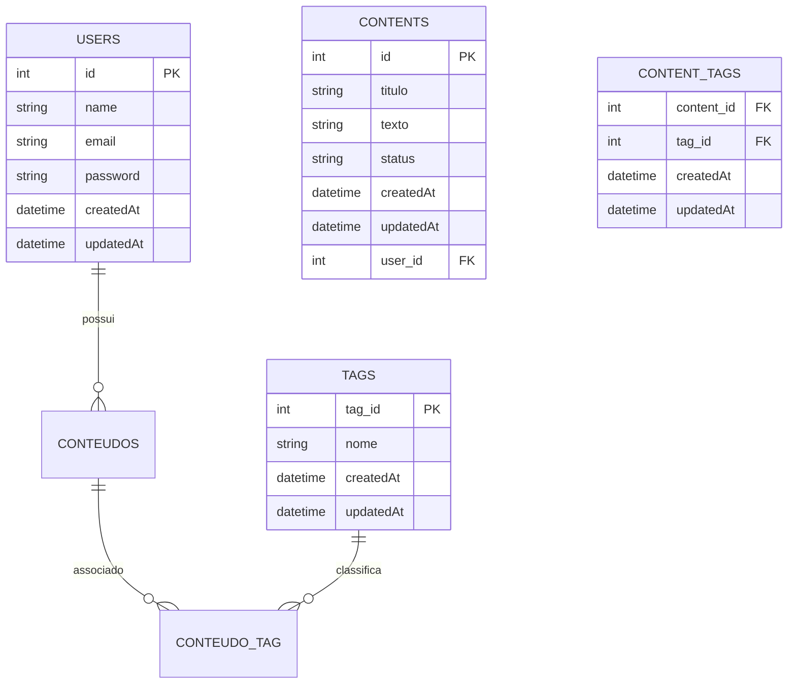

# Sistema de Gerenciamento de Conteúdo Pessoal Dinâmico (SGCPD)

## 📑 Sumário

- [📌 Descrição](#-descrição)
- [👨‍💻 Equipe de Desenvolvimento](#-equipe-de-desenvolvimento)
- [📅 Cronograma de Entregas](#-cronograma-de-entregas)
- [🛠️ Tecnologias Utilizadas](#️-tecnologias-utilizadas)
- [🚀 Funcionalidades](#-funcionalidades)
- [📋 Requisitos do Sistema](#-requisitos-do-sistema)
- [🗃️ Modelo Entidade-Relacionamento (MER)](#️-modelo-entidade-relacionamento-mer)
- [📂 Estrutura do Projeto](#-estrutura-do-projeto-proposta)
- [⚙️ Como Executar o Projeto](#️-como-executar-o-projeto)
- [🗂️ Divisão de Tarefas](#️-divisão-de-tarefas)
- [📖 Licença](#-licença)

---

## 📌 Descrição

O **SGCPD** é uma aplicação web desenvolvida com **Node.js, React e PostgreSQL**, conteinerizada com **Docker**,
para gerenciamento de conteúdos pessoais (ex.: notas de texto).  
O sistema permite criar, organizar, buscar e filtrar informações de forma simples e intuitiva, inspirado em ferramentas como o [Evernote](https://evernote.com/pt-br).

---

## 👨‍💻 Equipe de Desenvolvimento

| Integrante        | Papel no Projeto                        | Principais Responsabilidades                                                                 |
| ----------------- | --------------------------------------- | --------------------------------------------------------------------------------------------- |
| **Owen**          | 🧑‍💻 Tech Lead / Fullstack              | Liderança técnica, definição de arquitetura, componentes React, navegação e integração com DB |
| **Solenir**       | 🎨 Frontend Developer / Fullstack       | Estilização (CSS), design responsivo, definição de componentes e implementação de telas        |
| **Renato**        | ⚙️ Backend Developer / Fullstack        | Desenvolvimento da API Node.js, modelagem de dados e endpoints                                |
| **Victor Alexandre** | 🧭 Product Owner / Scrum Master / QA | Organização do time, documentação, acompanhamento das entregas, design, testes e validação    |


---

## 📅 Cronograma de Entregas

- **Entrega 1 (22/09/2025)** → [Protótipo visual](https://www.figma.com/design/9uV5xXigW1zoeqREa4u6e6/Tarefa-Frontend---UFG-TJGO?m=auto&t=JKAtn9DRB2dW3C13-1) no Figma. ✅
- **Entrega 2 (29/09/2025)** → CRUD funcional de uma entidade - Será apresentado em aula. ✅
- **Entrega 3 (06/10/2025)** → Projeto final completo (CRUD + filtros + responsividade) - Será apresentado em aula. ✅

---

## 🛠️ Tecnologias Utilizadas

- React (Front-End)
- Node.js + Express (Back-End)
- PostgreSQL (Banco de Dados)
- Docker + Docker Compose
- CSS3

---

## 🚀 Funcionalidades

- **CRUD de Usuários**
- **CRUD de Conteúdo**
- **Categorização e Tags**
- **Busca e Filtragem**
- **Design Responsivo**
- **Interface Intuitiva (UX)**

---

## 📋 Requisitos do Sistema

### 🔹 Requisitos Funcionais

| ID    | Requisito          | Descrição                                    |
| ----- | ------------------ | -------------------------------------------- |
| RF-01 | CRUD de Usuário    | Criar, ler, atualizar e deletar usuários.    |
| RF-02 | CRUD de Conteúdo   | Criar, ler, atualizar e deletar notas.       |
| RF-03 | Tags               | Adicionar categorias/tags.                   |
| RF-04 | Filtragem e Busca  | Buscar itens por texto, categoria ou status. |
| RF-05 | Responsividade     | Funcionar em desktop, tablet e mobile.       |

### 🔹 Requisitos Não Funcionais

| ID     | Requisito        | Descrição                               | Justificativa                |
| ------ | ---------------- | --------------------------------------- | ---------------------------- |
| RNF-01 | Usabilidade (UX) | Interface clara, lógica e com feedback. | Boa experiência do usuário.  |
| RNF-02 | Performance      | Respostas rápidas.                      | Melhor retenção.             |
| RNF-03 | Manutenibilidade | Código modular e comentado.             | Facilita evolução.           |
| RNF-04 | Segurança        | Hash de senhas e comunicação segura.    | Protege dados.               |
| RNF-05 | Ambiente DevOps  | Docker Compose.                         | Evita conflitos de ambiente. |

---

## 🗃️ Modelo Entidade-Relacionamento (MER)



---

## 📂 Estrutura do Projeto 

```bash
Trabalho Final/
│── client/
│   ├── public/
│   └── src/
│       ├── api/
│       │   └── api.js
│       ├── components/
│       │   ├── auth/
│       │   ├── footer/
│       │   ├── header/
│       │   ├── layout/
│       │   └── sidebar/
│       ├── contexts/
│       ├── pages/
│       │   ├── home/
│       │   ├── notes/
│       │   ├── profile/
│       │   ├── signIn/
│       │   ├── signUp/
│       │   └── tags/
│       ├── routes/
│       │   └── index.js
│       ├── utils/
│       │   └── validation.js
│       ├── App.css
│       ├── App.js
│       ├── App.test.js
│       ├── index.css
│       ├── index.js
│       ├── logo.svg
│       ├── reportWebVitals.js
│       ├── setupTests.js
│       └── styles.css
│   ├── .env
│   ├── .gitignore
│   ├── Dockerfile.dev
│   ├── package-lock.json
│   ├── package.json
│   └── README.md
│
│── server/
│   ├── config/
│   ├── migrations/
│   ├── models/
│   ├── routes/
│   ├── seeders/
│   ├── src/
│   ├── .env
│   ├── .gitignore
│   ├── Dockerfile.dev
│   ├── entrypoint.sh
│   ├── package-lock.json
│   └── package.json
│
│── .gitignore
│── Atividade - Projeto Final.pdf
│── docker-compose.yml
│── README.md
```

---

## ⚙️ Como Executar o Projeto

1. Clone este repositório:
   ```bash
   git clone https://github.com/victor-alexandre/TJGO-Frontend.git
   ```
2. Acesse a pasta do projeto:
   ```bash
   cd Trabalho Final
   ```
3. Suba os containers com Docker Compose:
   ```bash
   docker-compose up --build
   ```
4. Acesse a aplicação no navegador:
   - Front-End → http://localhost:3000
   - Back-End → http://localhost:3001
   - Banco → localhost:5432

---

## 🗂️ Divisão de Tarefas

| Tópico        | Tarefa                                                             | Responsável    | Data Entrega | Status | Observações                                    |
| ------------- | ------------------------------------------------------------------ | -------------- | ------------ | ------ | ---------------------------------------------- |
| Documentação  | Criar Readme no git                                                | Victor         | 15/09/2025   | OK     |                                                |
| Documentação  | Criar MER do banco                                                 | Owen           | 15/09/2025   | OK     |                                                |
| Documentação  | Criar DER do banco                                                 | Victor         | 22/09/2025   | OK     |                                                |
| Documentação  | Definir os requisitos                                              | Renato         | 17/09/2025   | OK     | Os requisitos definidos serão colocados no Readme |
| Documentação  | Consolidar a documentação no Readme do GitHub                      | Victor         |              | OK     |                                                |
| Design        | Criar os fluxos no Figma                                           | Victor         | 21/09/2025   | OK     |                                                |
| Código        | Criar a API - backend Node                                         | Owen/Victor    |              | OK     |                                                |
| Código        | Definir rotas                                                      | Victor         |              | OK     |                                                |
| Código        | Adicionar usuário                                                  | Victor         |              | OK     |                                                |
| Código        | Editar usuário                                                     | Victor         |              | OK     |                                                |
| Código        | Adicionar Nota                                                     | Victor/Renato  |              | OK     |                                                |
| Código        | Buscar Nota                                                        | Victor         |              | OK     |                                                |
| Código        | Editar Nota                                                        | Victor/Renato  |              | OK     |                                                |
| Código        | Adicionar TAG                                                      | Victor         |              | OK     |                                                |
| Código        | Criar o arquivo de configuração Backend: `dockerfile`              | Owen/Victor    |              | OK     |                                                |
| Código        | Criar o banco - Postgres (ou usar equivalente às migrations Ruby)  | Owen           |              | OK     |                                                |
| Código        | Criar o frontend - React                                           | Solenir/Renato |              | OK     |                                                |
| Código        | Definir Componentes                                                | Solenir        |              | OK     |                                                |
| Código        | Tela Cadastro                                                      | Solenir        |              | OK     |                                                |
| Código        | Tela Login                                                         | Solenir        |              | OK     |                                                |
| Código        | Tela página principal                                              | Solenir        |              | OK     |                                                |
| Código        | Tela de adicionar nota                                             | Renato         |              | OK     |                                                |
| Código        | Tela de editar nota                                                | Renato         |              | OK     |                                                |
| Código        | Tela de adicionar tag                                              | Renato         |              | OK     |                                                |
| Código        | Tela de editar tag                                                 | Renato         |              | OK     |                                                |
| Código        | Tela de editar perfil                                              | Renato         |              | OK     |                                                |
| Código        | Menu Lateral                                                       | Solenir        |              | OK     |                                                |
| Código        | Busca de notas por tag, título e conteúdo                          | Solenir        |              | OK     |                                                |
| Código        | Criar o arquivo de configuração Frontend: `dockerfile`             | Solenir        |              | OK     |                                                |
| Código        | Criar o deploy com o Docker Compose                                | Owen/Victor    |              | OK     |                                                |
| Revisão Geral | Revisão geral do projeto                                           | Todos          |              | OK     |                                                |
| Apresentação  | Apresentar durante a aula o projeto                                | Victor/Owen    |              |        |                                                |

---

## 📖 Licença

Projeto acadêmico, sem fins comerciais.
