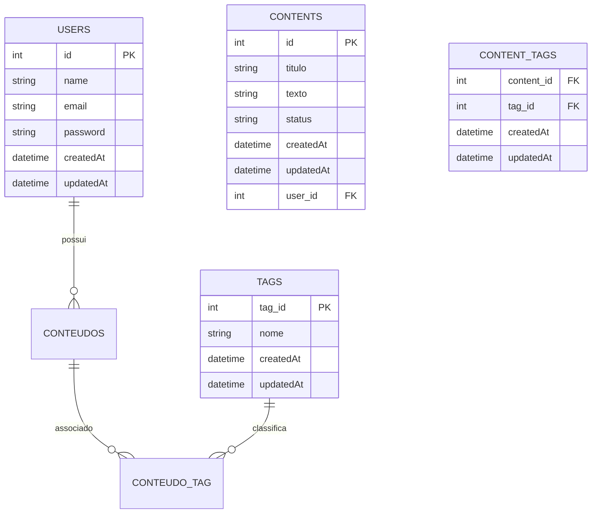

# Sistema de Gerenciamento de Conteúdo Pessoal Dinâmico (SGCPD)

## 📑 Sumário

- [📌 Descrição](#-descrição)
- [📅 Cronograma de Entregas](#-cronograma-de-entregas)
- [🛠️ Tecnologias Utilizadas](#️-tecnologias-utilizadas)
- [🚀 Funcionalidades](#-funcionalidades)
- [📋 Requisitos do Sistema](#-requisitos-do-sistema)
- [🗃️ Modelo Entidade-Relacionamento (MER)](#️-modelo-entidade-relacionamento-mer)
- [📂 Estrutura do Projeto](#-estrutura-do-projeto-proposta)
- [⚙️ Como Executar o Projeto](#️-como-executar-o-projeto)
- [👨‍💻 Equipe de Desenvolvimento](#-equipe-de-desenvolvimento)
- [🗂️ Divisão de Tarefas](#️-divisão-de-tarefas)
- [📖 Licença](#-licença)

---

## 📌 Descrição

O **SGCPD** é uma aplicação web desenvolvida com **Node.js, React e PostgreSQL**, conteinerizada com **Docker**,
para gerenciamento de conteúdos pessoais (ex.: notas de texto).  
O sistema permite criar, organizar, buscar e filtrar informações de forma simples e intuitiva, inspirado em ferramentas como o [Evernote](https://evernote.com/pt-br).

---

## 📅 Cronograma de Entregas

- **Entrega 1 (22/09/2025)** → [Protótipo visual](https://www.figma.com/design/9uV5xXigW1zoeqREa4u6e6/Tarefa-Frontend---UFG-TJGO?m=auto&t=JKAtn9DRB2dW3C13-1) no Figma ✅
- **Entrega 2 (29/09/2025)** → CRUD funcional de uma entidade - Será apresentado em aula.
- **Entrega 3 (06/10/2025)** → Projeto final completo (CRUD + filtros + responsividade) - Será apresentado em aula.

---

## 🛠️ Tecnologias Utilizadas

- React (Front-End)
- Node.js + Express (Back-End)
- PostgreSQL (Banco de Dados)
- Docker
- CSS3

---

## 🚀 Funcionalidades

- **CRUD de Usuários**
- **CRUD de Conteúdo**
- **Categorização e Tags**
- **Busca e Filtragem**
- **Design Responsivo**
- **Interface Intuitiva (UX)**

---

## 📋 Requisitos do Sistema

### 🔹 Requisitos Funcionais

| ID    | Requisito          | Descrição                                    |
| ----- | ------------------ | -------------------------------------------- |
| RF-01 | CRUD de Usuário    | Criar, ler, atualizar e deletar usuários.    |
| RF-02 | CRUD de Conteúdo   | Criar, ler, atualizar e deletar notas.       |
| RF-03 | Tags               | Adicionar categorias/tags.                   |
| RF-04 | Filtragem e Busca  | Buscar itens por texto, categoria ou status. |
| RF-05 | Interface Amigável | Navegação intuitiva e design claro.          |
| RF-06 | Responsividade     | Funcionar em desktop, tablet e mobile.       |

### 🔹 Requisitos Não Funcionais

| ID     | Requisito        | Descrição                               | Justificativa                |
| ------ | ---------------- | --------------------------------------- | ---------------------------- |
| RNF-01 | Usabilidade (UX) | Interface clara, lógica e com feedback. | Boa experiência do usuário.  |
| RNF-02 | Performance      | Respostas rápidas.                      | Melhor retenção.             |
| RNF-03 | Manutenibilidade | Código modular e comentado.             | Facilita evolução.           |
| RNF-04 | Segurança        | Hash de senhas e comunicação segura.    | Protege dados.               |
| RNF-05 | Ambiente DevOps  | Docker Compose.                         | Evita conflitos de ambiente. |

---

## 🗃️ Modelo Entidade-Relacionamento (MER)



---

## 📂 Estrutura do Projeto (Proposta)

```bash
SGCPD/
│── client/
│   ├── public/
│   └── src/
│       ├── components/
│       ├── pages/
│       ├── services/
│       └── App.js
│
│── server/
│   ├── src/
│   │   ├── controllers/
│   │   ├── models/
│   │   ├── routes/
│   │   └── server.js
│   └── package.json
│
│── docker-compose.yml
│── README.md
```

---

## ⚙️ Como Executar o Projeto

1. Clone este repositório:
   ```bash
   git clone https://github.com/victor-alexandre/TJGO-Frontend.git
   ```
2. Acesse a pasta do projeto:
   ```bash
   cd Trabalho Final
   ```
3. Suba os containers com Docker Compose:
   ```bash
   docker-compose up --build
   ```
4. Rode as migrações do banco de dados:
   ```bash
    docker-compose exec server npx sequelize-cli db:migrate
   ```
5. Acesse a aplicação no navegador:
   - Front-End → http://localhost:3000
   - Back-End → http://localhost:3001
   - Banco → localhost:5432

---

## 👨‍💻 Equipe de Desenvolvimento

- Owen → Fullstack - Estrutura de componentes React e navegação.
- Solenir → Fullstack - Estilização (CSS) e responsividade.
- Renato → Backend - API Node.js.
- Owen/Solenir → Integração com PostgreSQL e busca.
- Victor Alexandre → PO/QA - Documentação, Design, Testes/Validação

---

## 🗂️ Divisão de Tarefas

| Tópico        | Tarefa                                                 | Responsável  | Data Entrega | Status       | Observações                                       |
| ------------- | ------------------------------------------------------ | ------------ | ------------ | ------------ | ------------------------------------------------- |
| Documentação  | Criar Readme no git                                    | Victor       | 15/09/2025   | OK           |                                                   |
| Documentação  | Criar MER do banco                                     | Owen         | 15/09/2025   | OK           |                                                   |
| Documentação  | Criar DER do banco                                     | Victor       | 22/09/2025   | OK           |                                                   |
| Documentação  | Definir os requisitos                                  | Renato       | 17/09/2025   | OK           | Os requisitos definidos serão colocados no Readme |
| Documentação  | Consolidar a documentação no Readme do GitHub          | Victor       |              | Em andamento | Conforme os artefatos estão sendo produzidos      |
| Design        | Criar os fluxos no Figma                               | Victor       | 21/09/2025   | OK           |                                                   |
| Código        | Criar a API - backend Node                             | Owen/Renato  |              |              |                                                   |
| Código        | Definir rotas                                          | Owen         |              |              |                                                   |
| Código        | Adicionar usuário                                      | Renato       |              |              |                                                   |
| Código        | Editar usuário                                         | Renato       |              |              |                                                   |
| Código        | Adicionar Nota                                         | Renato       |              |              |                                                   |
| Código        | Buscar Nota                                            | Renato       |              |              |                                                   |
| Código        | Editar Nota                                            | Renato       |              |              |                                                   |
| Código        | Adicionar TAG                                          | Renato       |              |              |                                                   |
| Código        | Criar o arquivo de configuração Backend: `dockerfile`  | Renato       |              |              |                                                   |
| Código        | Criar o banco - Postgres (ou migrations estilo Ruby)   | Owen/Renato  |              |              |                                                   |
| Código        | Criar o frontend - React                               | Owen/Solenir |              |              |                                                   |
| Código        | Definir Componentes                                    | Owen         |              |              |                                                   |
| Código        | Tela Cadastro                                          | Solenir      |              |              |                                                   |
| Código        | Tela Login                                             | Solenir      |              |              |                                                   |
| Código        | Tela página principal                                  | Owen         |              |              |                                                   |
| Código        | Tela de adicionar nota                                 | Owen         |              |              |                                                   |
| Código        | Tela de editar perfil                                  | Solenir      |              |              |                                                   |
| Código        | Menu Lateral                                           | Owen         |              |              |                                                   |
| Código        | Busca de notas por tag, título e conteúdo              | Owen         |              |              |                                                   |
| Código        | Criar o arquivo de configuração Frontend: `dockerfile` | Solenir      |              |              |                                                   |
| Código        | Criar o deploy com o docker compose                    | Owen         |              |              |                                                   |
| Revisão Geral | Revisão geral do projeto                               | Todos        |              |              |                                                   |
| Apresentação  | Apresentar durante a aula o projeto                    | Victor/Owen  |              |              |                                                   |

---

## 📖 Licença

Projeto acadêmico, sem fins comerciais.
